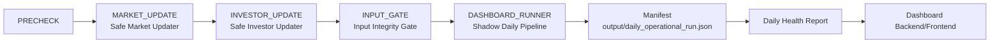

# BAIKAL Stock Signal
## Daily Operations Manual v1.0
### Dashboard STEP 6 Baseline

> 이 문서는 2026-09-04 기준, HEAD/origin/main = `0b2958f77e57301b38a657d14dc1d346b6aa0f96` (main, Working Tree clean) 코드를 실제로 조사하여 작성했다.
> 존재하지 않는 명령/기능은 기재하지 않았으며, 모든 명령은 repository 내 실제 코드(`scripts/`, `dashboard/`, `src/`, `tests/`)를 근거로 한다.

---

## 0. 용어

| 용어 | 실제 코드 위치 |
|------|----------------|
| Daily Operational Orchestrator | [scripts/daily_operational_run.py](../scripts/daily_operational_run.py) `run_daily_operation()` |
| Safe Market Updater | [scripts/safe_market_update.py](../scripts/safe_market_update.py) `SafeMarketUpdater` |
| Safe Investor Updater | [scripts/safe_investor_update.py](../scripts/safe_investor_update.py) `SafeInvestorUpdater` |
| Input Integrity Gate | [scripts/input_integrity_gate.py](../scripts/input_integrity_gate.py) `run_input_integrity_gate()` |
| Dashboard Runner (Shadow Pipeline 실행) | [dashboard/runner/shadow_dashboard_runner.py](../dashboard/runner/shadow_dashboard_runner.py) `run_dashboard_pipeline()` |
| Daily Health / Exception Report | [scripts/daily_health_report.py](../scripts/daily_health_report.py) `build_report()` |
| Dashboard Backend API | [dashboard/api.py](../dashboard/api.py) |
| Dashboard Frontend | [dashboard/frontend/](../dashboard/frontend/) (Vite + React) |

---

## 1. 시스템 운영 구조 (실제 코드 흐름)

`daily_operational_run.py`의 `run_daily_operation()`은 다음 순서로 5개 Phase를 실행한다 (`PRECHECK → MARKET_UPDATE → INVESTOR_UPDATE → INPUT_GATE → DASHBOARD_RUNNER`).



각 Phase 실패 시 이후 Phase는 실행되지 않고 즉시 중단된다 (stop-on-fail).

- **DASHBOARD_RUNNER** 내부에서 실제로 실행되는 것은 `scripts/shadow_daily_pipeline.py`의 Shadow Daily Pipeline이다 (STEP2 daily scan → STEP3 forward return update → STEP4 benchmark update → STEP5 performance report, 4단계 순차 실행, phase별 PASS/FAIL 격리).
- **주의**: 사용자 안내문의 "Signal / Shadow / Validation" 개념 흐름 중, 실제 구현에서 하나로 통합되어 있는 것은 "Shadow Daily Pipeline" 뿐이다. `python -m src.main` (README에 기술된 baseline signal 생성 스크립트, `output/signals.csv`/`output/summary.csv` 생성)은 Daily Operational Orchestrator에 포함되어 있지 않다. 즉 **Daily Run에서 자동으로 실행되는 것은 Shadow Pipeline이며, `src.main`은 별도 수동 실행 대상**이다.
- 모든 결과는 `output/daily_operational_run.json`에 원자적(atomic write, temp file + fsync + os.replace)으로 기록된다.
- 동시 실행 방지를 위해 `output/daily_operational_run.lock` 파일 기반 lock을 사용한다 (12시간 경과 시 stale lock 자동 해제).

---

## 2. 최초 실행 준비 (Windows PowerShell)

### 2-1. 프로젝트 디렉터리 이동
```powershell
cd C:\baikal777\baikal-stock-signal-backtest
```

### 2-2. Python 가상환경
```powershell
python -m venv .venv
Set-ExecutionPolicy -Scope Process -ExecutionPolicy RemoteSigned
.\.venv\Scripts\Activate.ps1
```

### 2-3. Python dependency 설치
```powershell
pip install -r requirements.txt
```
[requirements.txt](../requirements.txt) 기준: `pandas`, `numpy`, `pytest`, `finance-datareader`, `requests`, `lxml`, `OpenDartReader`.

### 2-4. Frontend dependency 설치
```powershell
cd dashboard\frontend
npm install
cd ..\..
```

### 2-5. 환경변수
조사 결과, STEP 6 Daily Operations 실행에 필요한 환경변수는 **없다**. (`scripts/safe_market_update.py`, `scripts/safe_investor_update.py`, `scripts/daily_operational_run.py`, `scripts/input_integrity_gate.py`, `dashboard/` 전체에서 `os.environ` / API Key 참조 없음.)
> `OpenDartReader`는 requirements에 있지만 STEP6 Daily 흐름(orchestrator)에서 사용되지 않는다 — 기업 재무데이터(fundamental) 관련 별도 step 스크립트(`scripts/step10_fundamental_feasibility.py` 등) 전용이다.

### 2-6. Backend 실행 확인 (1회성 점검)
```powershell
python -m dashboard.api
```
→ `http://127.0.0.1:8765` 에서 API 서버가 뜬다 (Ctrl+C로 종료).

### 2-7. Frontend 실행 확인 (1회성 점검)
```powershell
cd dashboard\frontend
npm run dev
```
→ `http://localhost:5173` 접속 확인 후 Ctrl+C로 종료.

---

## 3. 정상 일일 운영 절차

### STEP A — Daily Operational Run 실행

**[목적]** Market Update → Investor Update → Input Integrity Gate → Shadow Daily Pipeline을 한 번에 순차 실행한다.

**[실제 실행 명령]**
```powershell
cd C:\baikal777\baikal-stock-signal-backtest
.\.venv\Scripts\Activate.ps1
python -m scripts.daily_operational_run --json
```
**주의**: `python scripts\daily_operational_run.py --json`처럼 파일 경로로 직접 실행하면 `ModuleNotFoundError: No module named 'dashboard'`가 발생한다. `scripts/`와 `dashboard/`가 모두 repository root 기준 패키지이므로 반드시 `-m` 모듈 방식으로 실행한다.

**[정상 결과]**
- 종료 코드 0
- 콘솔에 JSON 출력, `overall_status`가 `SUCCESS` 또는 `SUCCESS_WITH_WARNING`

**[확인할 파일/화면]**
- [output/daily_operational_run.json](../output/daily_operational_run.json) — 이번 실행의 전체 manifest (phases 배열 포함)

**[실패 시 다음 행동]**
- 종료 코드 1 또는 `overall_status: FAILED` → 7장 "장애 대응" 참조. 원인 파악 전 재실행 금지.

### STEP B — Daily Health / Exception Report 확인

**[목적]** 방금 생성된 manifest를 읽기 전용으로 해석하여 운영자가 판단하기 쉬운 리포트를 생성한다.

**[실제 실행 명령]**
```powershell
python scripts\daily_health_report.py
```
JSON 형식이 필요하면:
```powershell
python scripts\daily_health_report.py --json
```

**[정상 결과]**
- 종료 코드 0, `HEALTH: HEALTHY` 또는 `HEALTH: WARNING`

**[확인할 파일/화면]**
- 콘솔 출력 (`=== DAILY HEALTH REPORT ===` 블록). 별도 파일로 저장되지 않는다 (manifest를 매번 읽어 즉석 생성).

**[실패 시 다음 행동]**
- `HEALTH: FAILED` 또는 종료 코드 1 → 리포트의 `ACTION:` 줄에 제시된 조치를 따른다.

### STEP C — Dashboard 실행 (STEP 5 절 참조)

Daily Run과 Health Report 확인 후, 필요 시 Dashboard backend/frontend를 실행하여 시각적으로 재확인한다 (5장 참조).

---

## 4. Daily Run 완료 후 확인

`output/daily_operational_run.json`(manifest)과 `python scripts\daily_health_report.py` 출력을 기준으로 판단한다.

| 항목 | 확인 위치 | 정상 판단 기준 |
|------|-----------|----------------|
| 거래일 | Health Report의 `RUN DATE` | `(TODAY)` 표시, `PREVIOUS_RUN`이면 오늘 실행분이 아님 |
| Market Update | manifest `market_update_status` | `UPDATED` 또는 `NO_NEW_DATA` (실패는 `FAILED`) |
| Investor Update | manifest `investor_update_status` | `UPDATED` / `NO_NEW_DATA` / `SOURCE_LAG` (실패는 `FAILED`) |
| Integrity Gate | manifest `gate_status`, `pipeline_allowed` | `PASS` 또는 `PASS_WITH_WARNING`, `pipeline_allowed: true` |
| Pipeline (Shadow Daily Pipeline) | manifest `dashboard_status` | `SUCCESS` |
| Signal | manifest `signal_count`, `zero_signal` / [output/shadow_dashboard_run_metadata.json](../output/shadow_dashboard_run_metadata.json)의 `record_count`, `signal_base_date` | `zero_signal: false`이면 신규 signal 존재 (0건도 정상 상태일 수 있음) |
| Shadow | [output/shadow_signal_records.csv](../output/shadow_signal_records.csv) (ledger) | 파일 존재 시 row 수 증가 여부 확인 (현재 baseline은 파일이 아직 없거나 0 records 상태일 수 있으며 이는 정상 — 아직 실거래일 signal 미발생) |
| Validation | [output/shadow_performance_report.md](../output/shadow_performance_report.md) | Shadow Daily Pipeline의 STEP5(performance report) phase가 PASS면 최신 내용으로 갱신됨 |
| Health Report | `python scripts\daily_health_report.py` 콘솔 출력 | `HEALTH: HEALTHY` |
| Exception | Health Report `WARNING:` / `ERROR:` / `ACTION:` 줄 | 없음 = 정상 |

---

## 5. Dashboard 실행 및 확인

### Backend 실행
```powershell
python -m dashboard.api
```
- 기본 주소: `http://127.0.0.1:8765`
- 제공 endpoint (모두 GET, read-only): `/api/dashboard/overview`, `/api/dashboard/signals`, `/api/dashboard/health`

### Frontend 실행
```powershell
cd dashboard\frontend
npm run dev
```
- 접속 주소: `http://localhost:5173`
- Vite dev server는 `/api` 요청을 `http://127.0.0.1:8765`로 proxy한다 ([vite.config.ts](../dashboard/frontend/vite.config.ts)). **Backend를 먼저 실행한 상태여야** frontend에서 데이터가 표시된다.

### 주요 화면 ([App.tsx](../dashboard/frontend/src/App.tsx) 기준)
Header(모드/읽기전용/Baseline commit 표시) 아래 다음 섹션이 순서대로 표시된다.
- System Status
- Today's Shadow
- Maturity Monitor
- Performance Overview
- Foreign Flow Monitor
- Weakness Monitor
- Risk Monitor
- Opportunity Cost Monitor
- Signal Ledger

### 항목별 확인 방법
- **최신 데이터 날짜**: System Status 섹션의 `market_data_date` / `investor_data_date` / `data_date` (내부적으로 `/api/dashboard/overview`의 `system` 객체)
- **Signal 확인**: Signal Ledger 섹션 (`/api/dashboard/signals`)
- **Shadow 확인**: Today's Shadow 섹션
- **Validation 확인**: Performance Overview 섹션
- **Health / Exception 확인**: **현재 미지원.** `/api/dashboard/health` API endpoint는 구현되어 있고 프론트엔드 API 클라이언트(`dashboardApi.getHealth()`)도 정의되어 있으나, `App.tsx`의 어떤 화면에서도 호출/표시하지 않는다. Health/Exception 확인은 반드시 3장 STEP B(`python scripts\daily_health_report.py`) 또는 manifest 파일을 직접 확인해야 한다.

---

## 6. 테스트 방법

가상환경 활성화 후 repository 루트에서 실행한다.

### A. 전체 Python regression
```powershell
python -m pytest -q
```
**PASS 기준**: `456 passed`, `0 failed` (현재 baseline).

### B. STEP 6 관련 테스트
```powershell
python -m pytest tests\test_daily_operational_run.py tests\test_daily_health_report.py tests\test_input_integrity_gate.py tests\test_safe_market_update.py tests\test_safe_investor_update.py tests\test_dashboard_adapter.py tests\test_dashboard_runner.py tests\test_shadow_step6_daily_pipeline.py -q
```
**PASS 기준**: 전부 `passed`, `0 failed`.

### C. Frontend test
```powershell
cd dashboard\frontend
npm run test
```
**PASS 기준**: `15 passed` (현재 baseline), 실패(FAIL) 없음.

### D. Frontend build
```powershell
cd dashboard\frontend
npm run build
```
**PASS 기준**: `tsc` 타입 에러 없이 `vite build`까지 종료 코드 0.

### E. 실제 E2E Daily Run
자동화된 별도 pytest 파일은 없다. 실제 명령을 직접 실행하는 것 자체가 E2E 검증이다.
```powershell
python -m scripts.daily_operational_run --json
python scripts\daily_health_report.py
```
**PASS 기준**: `overall_status` = `SUCCESS` 또는 `SUCCESS_WITH_WARNING`, Health Report가 `HEALTHY` 또는 `WARNING`(FAILED 아님).

### F. 동일 날짜 rerun
```powershell
python -m scripts.daily_operational_run --json
python -m scripts.daily_operational_run --json
```
**PASS 기준**: 두 번째 실행도 `FAILED`가 아니어야 하며 (동시 lock으로 즉시 실패하지 않도록 첫 실행이 끝난 뒤 재실행), Market/Investor는 `NO_NEW_DATA` 상태로 재수렴, Shadow ledger에 중복 레코드가 생기지 않아야 한다. 관련 자동 테스트: `tests\test_safe_market_update.py::test_rerun_idempotency`, `tests\test_safe_investor_update.py::test_rerun_idempotency`, `tests\test_shadow_step6_daily_pipeline.py::test_pipeline_rerun_is_idempotent`, `tests\test_input_integrity_gate.py::test_18_rerun_deterministic`, `tests\test_daily_operational_run.py::test_rerun_safe_and_lock_rejects_concurrent_run`.

### G. Historical Immutability 확인
자동 테스트로 확인한다 (과거 데이터가 재실행으로 바뀌지 않는지 검증):
```powershell
python -m pytest tests\test_safe_investor_update.py::test_historical_immutability tests\test_shadow_step3_forward_returns.py::test_immutable_fields_are_not_modified tests\test_shadow_step4_benchmark.py::test_immutable_fields_unchanged tests\test_shadow_step6_daily_pipeline.py::test_immutable_fields_unchanged -q
```
**PASS 기준**: 전부 `passed`.

---

## 7. 장애 대응

공통 원칙: **원인 파악 전 강제 재실행/파일 수정 금지.**

### Market 데이터 수집 실패
- 증상: manifest `market_update_status: FAILED`, Health Report `FAILED PHASE: MARKET_UPDATE`
- 확인: manifest의 `MARKET_UPDATE` phase `metrics.failures` (ticker별 실패 사유)
- 조치: 네트워크/소스(FinanceDataReader) 상태 확인. `data/raw/` 파일을 손으로 고치지 않는다.
- 재실행 여부: 원인 해소 후 `python -m scripts.daily_operational_run` 재실행 가능 (staging→검증→publish 구조라 안전)
- 금지사항: `data/raw/*.csv` 직접 수정, staging/backup 파일 삭제

### Investor 데이터 수집 실패
- 증상: manifest `investor_update_status: FAILED`
- 확인: `INVESTOR_UPDATE` phase `metrics.failed_tickers`, `source_lag_type`
- 조치: Naver 소스 접근 가능 여부, 티커별 최신일자 정렬 상태 확인
- 재실행 여부: 원인 해소 후 재실행 가능
- 금지사항: `data/investor/*.csv` 직접 수정

### Input Integrity Gate FAIL
- 증상: manifest `gate_status: FAIL`, `pipeline_allowed: false`
- 확인: `python scripts\input_integrity_gate.py --json` 단독 실행으로 상세 사유(`errors`, `warnings`, `market_coverage`, `investor_coverage`) 확인
- 조치: 누락/비정합 입력 파일을 원인별로 파악 (직접 수정 금지, Safe Updater 재실행으로 해결)
- 재실행 여부: 원인 해결 후 Daily Run 재실행
- 금지사항: Gate 우회 (`--allow-source-lag` 등 옵션은 정책 범위 내에서만 사용, 임의 강제 통과 금지)

### Daily Pipeline 실패 (DASHBOARD_RUNNER / Shadow Daily Pipeline)
- 증상: manifest `dashboard_status: FAILED`
- 확인: manifest `DASHBOARD_RUNNER` phase의 `metrics`, 콘솔에 출력된 traceback(있는 경우)
- 조치: `scripts/shadow_daily_pipeline.py` 4단계(scan/return/benchmark/report) 중 어느 phase에서 실패했는지 확인
- 재실행 여부: 원인 해결 후 재실행. Shadow 로직(`src/shadow_tracking.py`, `src/shadow_performance.py`)은 절대 수정하지 않는다.
- 금지사항: `output/shadow_signal_records.csv` 수동 편집

### Health Report WARNING/FAIL
- 증상: `python scripts\daily_health_report.py` → `HEALTH: WARNING` 또는 `HEALTH: FAILED`
- 확인: 출력된 `WARNING:` / `ERROR:` / `ACTION:` 줄
- 조치: `ACTION:` 항목을 따라 원인 phase(Market/Investor/Gate/Pipeline) 재점검
- 재실행 여부: 원인 해결 후 Daily Run 재실행 → Health Report 재확인
- 금지사항: manifest(`output/daily_operational_run.json`) 직접 편집

### Dashboard 데이터 미표시
- 증상: Frontend 화면에 데이터가 뜨지 않거나 에러 표시
- 확인: Backend(`python -m dashboard.api`)가 `127.0.0.1:8765`에서 실행 중인지, `curl http://127.0.0.1:8765/api/dashboard/overview` 응답 확인
- 조치: Backend 먼저 기동 후 Frontend 새로고침
- 재실행 여부: Backend/Frontend 재시작으로 충분, Daily Run 재실행 불필요
- 금지사항: 데이터 파일을 직접 만들어 채워 넣지 않는다

### 동일 날짜 재실행 필요
- 증상: 실패 후 원인 해결, 같은 거래일에 다시 실행해야 함
- 확인: `output/daily_operational_run.lock` 존재 여부 (이전 실행이 비정상 종료 시 남을 수 있음, 12시간 경과 시 자동 해제)
- 조치: 정상적으로 `python -m scripts.daily_operational_run` 재실행 (기존 idempotency 구조가 중복/오염을 방지)
- 재실행 여부: 가능 (6장 F항목 참조)
- 금지사항: lock 파일을 임의 삭제하여 강제로 동시 실행 유도

### 프로그램 실행 중 중단 (Ctrl+C, 강제 종료 등)
- 증상: `daily_operational_run.py` 실행 중 프로세스가 비정상 종료됨
- 확인: `output/daily_operational_run.lock` 잔존 여부, manifest가 갱신되었는지 여부
- 조치: 12시간 이내면 stale lock이 자동 해제되지 않으므로, 원인(진짜 동시 실행 여부)을 먼저 확인한 뒤에만 재실행
- 재실행 여부: 원인 확인 후 재실행 (staging/atomic publish 구조로 데이터 손상 위험은 낮음)
- 금지사항: lock 파일 강제 삭제 후 원인 확인 없이 바로 재실행

---

## 8. 운영 안전수칙

- 과거 데이터(`data/raw/`, `data/investor/`, Shadow ledger) 임의 수정 금지
- 기존 Signal 로직(`src/signal_engine.py`, `src/stock_selection.py`) 수정 금지
- Shadow 로직(`src/shadow_tracking.py`, `src/shadow_performance.py`, `scripts/shadow_*.py`) 수정 금지
- Validation 로직(Input Integrity Gate, Health Report 판정 기준) 수정 금지
- 실패했다고 `output/`, `data/` 내 파일을 수동으로 고치지 않는다
- rerun은 반드시 기존 idempotency 구조(`python -m scripts.daily_operational_run` 재실행)를 통해서만 수행한다
- Input Integrity Gate 우회 금지 (`--allow-source-lag`는 정책에 정의된 허용 범위 내 옵션이며, 임의 강제 통과가 아니다)
- 원인을 모르는 상태에서 강제 진행(재실행, lock 삭제, 파일 수정) 금지

---

## 9. 운영자 Quick Guide (1페이지 체크리스트)

**[운영 전]**
- [ ] 오늘이 거래일인지 확인
- [ ] 가상환경 활성화 (`.\.venv\Scripts\Activate.ps1`)
- [ ] `output/daily_operational_run.lock` 잔존 여부 확인

**[실행]**
- [ ] `python -m scripts.daily_operational_run --json` 실행

**[결과 확인]**
- [ ] Market: manifest `market_update_status` = `UPDATED`/`NO_NEW_DATA`
- [ ] Investor: manifest `investor_update_status` = `UPDATED`/`NO_NEW_DATA`/`SOURCE_LAG`
- [ ] Integrity Gate: manifest `gate_status` = `PASS`/`PASS_WITH_WARNING`, `pipeline_allowed: true`
- [ ] Pipeline: manifest `dashboard_status` = `SUCCESS`
- [ ] Health: `python scripts\daily_health_report.py` → `HEALTH: HEALTHY`/`WARNING`
- [ ] Dashboard 최신일 확인: (`python -m dashboard.api` + `npm run dev`) System Status 섹션 `data_date`

**[이상 발생 시]**
- [ ] Health Report의 `WARNING:`/`ERROR:`/`ACTION:` 확인
- [ ] 7장 "장애 대응" 절차에 따라 원인 확인
- [ ] 원인 해소 후에만 안전한 rerun (`python -m scripts.daily_operational_run`)
