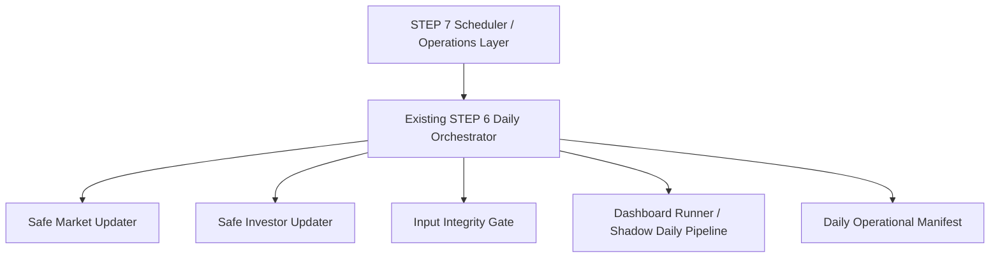
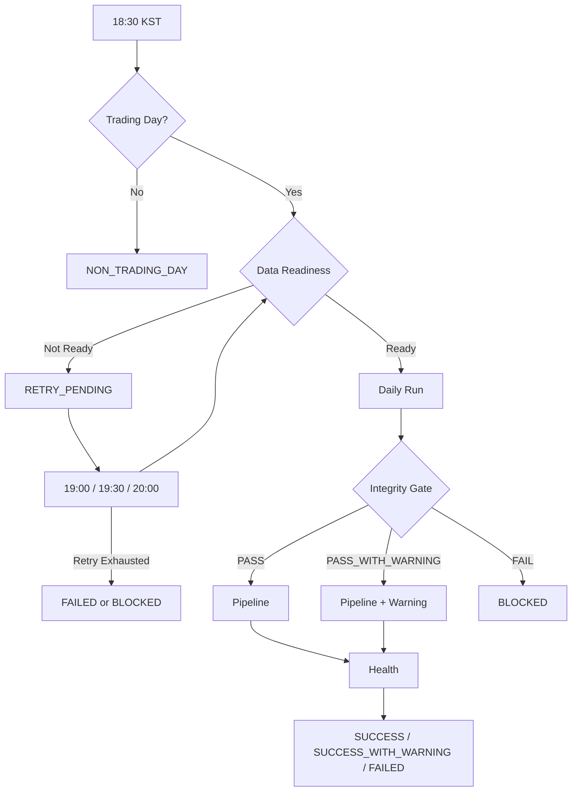
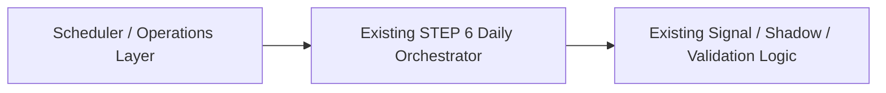

# BAIKAL Stock Signal
## Daily Operations Run Policy v1
### Dashboard STEP 7-1

> 작성 기준: 2026-09-04, `main`, HEAD/origin/main `983486912670ff27f2b81d6663466d79ba57baa2`.
> 이 문서는 STEP 7 자동운영 구현 전에 운영 정책을 확정하기 위한 문서다. 코드, scheduler, dashboard, signal, shadow, validation 로직과 기존 output schema는 변경하지 않는다.

---

## 1. 목적

Daily Operations Run Policy v1의 목적은 STEP 6 Daily Operations 구현을 보존한 상태에서, STEP 7 자동운영 scheduler가 따라야 할 운영 시간, 데이터 준비도, retry, status, 장애 대응, dashboard 표시 요구사항을 명확히 정의하는 것이다.

정책의 기본 원칙은 다음과 같다.

- STEP 7은 기존 STEP 6 Daily Orchestrator를 수정하지 않고 그 위에 별도 Scheduler / Operations Layer로 추가한다.
- `NO_NEW_DATA`를 기계적으로 실패나 retry 조건으로 해석하지 않는다.
- Integrity Gate `FAIL`은 pipeline 실행 금지 상태로 취급한다.
- 과거 데이터 및 Shadow ledger의 historical immutability를 훼손하지 않는다.
- 기존 output schema 변경을 전제로 하지 않는다.

권장 구조:



---

## 2. 적용 범위

이 문서는 다음 범위에만 적용한다.

- 한국 증시 운영일 기준 daily run scheduling 정책
- 18:30 KST 1차 실행 및 19:00 / 19:30 / 20:00 retry 정책
- STEP 7 orchestration status 모델
- 운영자 개입 기준
- STEP 7-2 scheduler 구현 요구사항 도출
- 향후 dashboard 운영 표시 요구사항 도출

명시적으로 다음 범위는 제외한다.

- scheduler 구현
- dashboard UI/API 수정
- signal 생성 로직 수정
- shadow tracking / shadow performance 로직 수정
- validation / integrity gate 로직 수정
- 기존 output schema 변경
- commit / push

---

## 3. 현재 STEP 6 Baseline

### 3.1 Daily Operational Orchestrator

현재 공식 Daily Run 명령은 다음이다.

```powershell
python -m scripts.daily_operational_run --json
```

실제 구현 위치는 [scripts/daily_operational_run.py](../scripts/daily_operational_run.py)이며, 실행 순서는 다음과 같다.

1. `PRECHECK`
2. `MARKET_UPDATE`
3. `INVESTOR_UPDATE`
4. `INPUT_GATE`
5. `DASHBOARD_RUNNER`

각 phase는 stop-on-fail 방식으로 실행된다. Market update가 실패하면 investor update 이후 단계가 실행되지 않고, investor update가 실패하면 input gate와 dashboard runner가 실행되지 않는다. Input gate가 `FAIL`이거나 `pipeline_allowed`가 false이면 dashboard runner가 실행되지 않는다.

Daily run 결과는 `output/daily_operational_run.json`에 atomic write로 기록된다. 동시 실행 방지는 `output/daily_operational_run.lock` 파일로 수행되며, lock은 12시간 이후 stale로 간주되어 제거될 수 있다.

### 3.2 Safe Market Updater

구현 위치는 [scripts/safe_market_update.py](../scripts/safe_market_update.py)이다.

현재 status:

| Status | 현재 의미 |
|--------|-----------|
| `UPDATED` | 모든 ticker 검증 성공 후 신규 row가 append되어 publish됨 |
| `NO_NEW_DATA` | 모든 ticker 검증 성공, 추가할 신규 row 없음, publish는 `SKIPPED_NO_NEW_DATA` |
| `FAILED` | fetch/schema/duplicate/future date/batch coverage/publish 계열 실패, publish 금지 또는 예외 |

Market `NO_NEW_DATA`는 실패가 아니다. 기존 최신일 이후 추가할 row가 없을 때 반환된다. 다만 source가 빈 DataFrame을 반환했고 기존 데이터가 updater의 `today`보다 과거이면 `unexpected empty source response`로 실패 처리한다. 현재 updater 자체에는 한국 거래일 캘린더 판정이 없다.

### 3.3 Safe Investor Updater

구현 위치는 [scripts/safe_investor_update.py](../scripts/safe_investor_update.py)이다.

현재 status:

| Status | 현재 의미 |
|--------|-----------|
| `UPDATED` | market target date까지 investor 신규 row가 append되어 publish됨 |
| `NO_NEW_DATA` | 모든 ticker 검증 성공, 추가할 신규 row 없음, publish는 `SKIPPED_NO_NEW_DATA` |
| `SOURCE_LAG` | 모든 ticker source latest date가 market target date보다 균일하게 뒤처졌지만 신규 row publish는 수행됨 |
| `FAILED` | raw market target 계산 실패, ticker fetch 실패, partial source lag, schema 오류, future date, publish 오류 등 |

Investor updater는 `data/raw/*.csv`의 configured ticker 최신일 중 최댓값을 `market_target_date`로 계산한다. `NO_NEW_DATA`는 실패가 아니지만, `source_latest_date` 또는 `published_latest_date`가 `market_target_date`보다 뒤처져 있을 수 있다. 따라서 STEP 7 scheduler는 investor `NO_NEW_DATA`만으로 readiness를 판단하면 안 되고, target trade date와 실제 latest date를 비교해야 한다.

### 3.4 Input Integrity Gate

구현 위치는 [scripts/input_integrity_gate.py](../scripts/input_integrity_gate.py)이다. Gate는 read-only이며 production CSV를 수정하지 않는다.

현재 status:

| Status | `pipeline_allowed` | 현재 의미 |
|--------|--------------------|-----------|
| `PASS` | true | error와 warning 없음 |
| `PASS_WITH_WARNING` | true | error 없음, warning 있음 |
| `FAIL` | false | error 있음 |

현재 alignment status:

| Status | 현재 의미 |
|--------|-----------|
| `CURRENT` | market latest date와 investor latest date가 같음 |
| `SOURCE_LAG` | investor latest date가 market latest date보다 과거임 |
| `STALE` | market latest date가 stale threshold를 초과함 |
| `INVALID` | latest date 부재, investor가 market보다 미래, 기타 invalid 상태 |

`allow_source_lag=True`이고 source lag가 `max_source_lag_days` 이내이면 Gate는 `PASS_WITH_WARNING`과 `pipeline_allowed=true`를 반환할 수 있다. STEP 6 default dependencies는 daily orchestrator에서 `allow_source_lag=True`를 사용한다.

### 3.5 Shadow Daily Pipeline

구현 위치는 [scripts/shadow_daily_pipeline.py](../scripts/shadow_daily_pipeline.py)이다.

현재 pipeline phase:

1. Daily scan
2. Forward returns
3. Benchmark / excess returns
4. Performance report

Pipeline 내부 status 표현은 `PASS`, `FAIL`, `SKIP`이다. 한 phase에서 예외가 발생하면 해당 phase는 `FAIL`, 이후 phase는 `SKIP`이 된다. `run_pipeline().ok`가 true이면 dashboard runner metadata의 `pipeline_status`는 `SUCCESS`, false이면 `FAILED`가 된다.

현재 pipeline 내부 자동 retry 기능은 없다.

### 3.6 Daily Health Report

구현 위치는 [scripts/daily_health_report.py](../scripts/daily_health_report.py)이다.

현재 health status:

| Status | 현재 의미 |
|--------|-----------|
| `HEALTHY` | 오늘의 manifest가 있고 `overall_status=SUCCESS` |
| `WARNING` | 오늘의 manifest가 `SUCCESS_WITH_WARNING`이거나, manifest가 이전 운영일 실행분이거나, naive timestamp 등 경고 상태 |
| `FAILED` | manifest가 실패 상태, 깨졌거나 필수 field 누락, 알 수 없는 overall status |
| `NO_RUN` | manifest 없음 |

Health report는 timezone-aware timestamp를 Asia/Seoul로 변환해 run date를 판단한다. Daily orchestrator와 updater 전체가 Asia/Seoul을 전역 운영 timezone으로 강제하는 구조는 아직 아니다.

### 3.7 Dashboard Runner / Adapter / API

현재 dashboard runner 구현 위치는 [dashboard/runner/shadow_dashboard_runner.py](../dashboard/runner/shadow_dashboard_runner.py)이다. Runner는 Shadow pipeline을 실행하고 `output/shadow_dashboard_run_metadata.json`을 atomic write한다.

현재 dashboard adapter/API는 read-only이다.

- [dashboard/api.py](../dashboard/api.py)는 `/api/dashboard/overview`, `/api/dashboard/signals`, `/api/dashboard/health` GET endpoint만 제공한다.
- [dashboard/adapter/service.py](../dashboard/adapter/service.py)는 operational metadata, shadow ledger, historical validation 파일을 읽어 dashboard payload를 만든다.
- [dashboard/contracts/dashboard_contract.py](../dashboard/contracts/dashboard_contract.py)의 dashboard metric status는 `AVAILABLE`, `EMPTY`, `STALE`, `MISSING`, `UNAVAILABLE`이다.

현재 dashboard가 이미 노출하는 주요 운영 항목:

- `pipeline_status`
- `last_run`
- `data_date`
- `market_data_date`
- `investor_data_date`
- `input_data_freshness`
- `ledger_status`
- `warnings`

현재 frontend에는 Daily Health / Exception Report의 상세 warning/error/action을 직접 표시하는 화면은 없다.

### 3.8 Rerun / Idempotency / Historical Immutability

현재 rerun 안전성은 다음 구조로 확보된다.

- Market updater: staging -> validation -> candidate build -> all ticker coverage gate -> atomic publish / rollback.
- Investor updater: staging -> validation -> market target alignment -> all ticker coverage gate -> atomic publish / rollback.
- Shadow store: 동일 `stock_code + signal_date` 중복 기록 방지, append-only record 생성.
- Forward return / benchmark update: immutable fields 보존, 기존 값 mismatch를 임의 overwrite하지 않음.
- Daily manifest와 dashboard metadata: temp file + fsync + `os.replace` atomic write.
- Daily run lock: 동일 시점 동시 실행 방지.

현재 manual rerun은 허용된다. 동일 데이터 상태에서 재실행하면 Market/Investor가 `NO_NEW_DATA`로 수렴할 수 있고, Shadow ledger에는 중복 signal이 생성되지 않아야 한다.

### 3.9 Trading Day / 휴장일 / Scheduler / Retry 현황

현재 STEP 6에는 다음 기능이 없다.

- 공식 한국 증시 거래일 캘린더 판정 없음
- 휴장일을 `NON_TRADING_DAY`로 종료하는 orchestration status 없음
- 18:30 자동 실행 scheduler 없음
- 19:00 / 19:30 / 20:00 데이터 지연 retry scheduler 없음
- pipeline 실패에 대한 자동 1회 retry 없음
- persistent scheduler state 없음

현재 존재하는 날짜 관련 처리:

- Health report는 Asia/Seoul 기준으로 manifest run date를 판단한다.
- Input gate는 `today_date`의 주말 여부를 freshness warning 계산에만 사용한다.
- Shadow scan은 각 ticker CSV의 최신 가격일을 최신 거래일로 사용한다.
- Forward return 계산은 calendar day가 아니라 가격 데이터 row 순서를 거래일 index로 사용한다.

---

## 4. 운영시간 정책

STEP 7 운영 timezone은 Asia/Seoul로 고정한다.

자동 실행 시각:

| 구분 | 시각 |
|------|------|
| 1차 자동 실행 | 18:30 KST |
| 데이터 지연 retry 1차 | 19:00 KST |
| 데이터 지연 retry 2차 | 19:30 KST |
| 데이터 지연 retry 3차 | 20:00 KST |

Retry는 최대 3회다. 18:30 최초 실행을 포함하면 최대 시도 횟수는 4회다.

STEP 7 scheduler는 모든 schedule 판단, target trade date 계산, missed run 판정, next retry 계산을 Asia/Seoul 기준으로 수행해야 한다. STEP 6 manifest timestamp 저장 방식은 그대로 둔다.

---

## 5. Trading Day 정책

운영 대상은 한국 증시 거래일이다.

STEP 7 scheduler는 실행 전에 target trade date가 한국 증시 거래일인지 판단해야 한다. 거래일이 아니면 STEP 6 Daily Orchestrator를 호출하지 않고 `NON_TRADING_DAY`로 정상 종료한다.

현재 STEP 6에는 공식 거래일 캘린더가 없으므로, `NON_TRADING_DAY`는 기존 STEP 6 status가 아니라 STEP 7 orchestration status이다.

휴장일 정책:

- 주말 및 한국 증시 휴장일은 `NON_TRADING_DAY`로 처리한다.
- `NON_TRADING_DAY`는 실패가 아니다.
- 휴장일에는 Market/Investor update, Input Gate, Shadow pipeline을 실행하지 않는 것을 기본으로 한다.
- 휴장일 상태는 scheduler/operations layer에 기록되어야 하며, 기존 `output/daily_operational_run.json` schema 변경을 전제로 하지 않는다.

---

## 6. Data Readiness 정책

Data readiness는 STEP 7 scheduler가 STEP 6 Daily Orchestrator 호출 전에 판단하는 외부 운영 정책이다.

### 6.1 기본 원칙

`NO_NEW_DATA`는 그 자체로 retry 조건이 아니다.

정상 rerun 예시:

- target trade date = `2026-09-04`
- latest market date = `2026-09-04`
- latest investor date = `2026-09-04`
- updater 결과 = `NO_NEW_DATA`

이 경우는 이미 target date 데이터가 준비된 상태에서 추가 신규 row가 없는 정상 rerun이므로 retry하지 않는다.

Retry 대상 예시:

- target trade date = `2026-09-04`
- latest market date < `2026-09-04`
- latest investor date < `2026-09-04`
- source 접근 실패가 명백히 일시적임

이 경우는 target trade date 데이터 자체가 준비되지 않았으므로 `RETRY_PENDING` 후보가 된다.

### 6.2 Market readiness

Market readiness는 target trade date와 market latest date를 비교해 판단한다.

- latest market date == target trade date: ready
- latest market date < target trade date: not ready, retry 후보
- ticker별 latest date 불일치: structural failure 후보, 자동 retry 금지 또는 매우 제한적 retry 후보
- schema, duplicate, future date, historical mutation 의심: retry 금지, `BLOCKED`

### 6.3 Investor readiness

Investor readiness는 target trade date, market target date, investor latest date를 함께 비교해 판단한다.

- latest investor date == target trade date: ready
- latest investor date < target trade date: data delay 후보
- 모든 ticker가 균일하게 지연되고 외부 source delay가 명백함: `RETRY_PENDING` 후보
- ticker별 investor latest date가 부분적으로 불일치함: partial source lag로 보며 자동 강행 금지
- schema, duplicate, future date, historical mutation 의심: retry 금지, `BLOCKED`

현재 STEP 6 default gate는 `allow_source_lag=True`일 때 제한적 `SOURCE_LAG`를 warning으로 통과시킬 수 있다. STEP 7 scheduler는 target trade date readiness 정책을 별도 layer에서 먼저 적용해야 하며, source lag 상태를 무조건 성공으로 해석하면 안 된다.

---

## 7. Retry 정책

### 7.1 데이터 지연 retry

데이터 지연 retry schedule은 다음과 같다.

1. 18:30 KST 최초 readiness check 및 실행
2. 19:00 KST retry 1차
3. 19:30 KST retry 2차
4. 20:00 KST retry 3차

자동 retry 가능 후보:

- target trade date의 Market 데이터 미도착
- target trade date의 Investor 데이터 미도착
- 모든 ticker가 동일한 최신일로 균일하게 지연된 source lag
- 명백한 일시적 외부 데이터 접근 실패
- 네트워크 timeout, temporary connection error 등 retry-safe transient error

자동 retry 금지:

- Integrity Gate `FAIL`
- historical mutation 감지 또는 의심
- schema/data corruption
- duplicate date, invalid date, future date
- ticker별 latest date partial mismatch
- batch coverage gate 실패 중 구조적 입력 오류
- programming error, import error, type error 등 코드 결함성 오류
- 원인 미분류 구조적 오류

### 7.2 Pipeline 실패 retry

Pipeline 정상 결과는 `SUCCESS`이다.

Pipeline 실행 실패가 명백히 일시적인 실행 실패로 분류되는 경우에 한해 STEP 7 scheduler는 자동 재시도 1회를 허용한다.

Pipeline 자동 retry 가능 후보:

- 일시적 파일 접근 충돌
- 일시적 외부 process/resource 문제
- retry 후 동일 입력으로 성공 가능성이 높은 transient error

Pipeline 자동 retry 금지:

- Shadow ledger malformed
- historical immutable field mismatch
- schema/data corruption
- programming error
- unknown market/data 오류가 구조적 원인으로 드러난 경우
- 원인 미분류 예외

현재 STEP 6 pipeline과 daily orchestrator에는 자동 retry 기능이 없다. 따라서 pipeline retry는 STEP 7 scheduler/operations layer의 신규 기능이어야 한다.

---

## 8. Status 모델

### 8.1 STEP 7 운영 상태 후보

STEP 7 orchestration status 후보는 다음이다.

| Status | 의미 |
|--------|------|
| `SUCCESS` | target trade date daily operation 정상 완료 |
| `SUCCESS_WITH_WARNING` | daily operation 완료, warning 존재, 즉시 수동 개입은 기본 불필요 |
| `RETRY_PENDING` | retry 가능한 데이터 지연 또는 transient condition으로 다음 scheduled retry 대기 |
| `BLOCKED` | 안전상 자동 진행 금지, 운영자 확인 필요 |
| `FAILED` | retry 소진 또는 비차단성 실행 실패 확정, 운영자 확인 필요 |
| `NON_TRADING_DAY` | 한국 증시 비거래일, 정상 미실행 |

### 8.2 현재 이미 존재하는 status

현재 코드에 이미 존재하는 관련 status:

- Daily orchestrator overall: `SUCCESS`, `SUCCESS_WITH_WARNING`, `FAILED`
- Safe Market Updater: `UPDATED`, `NO_NEW_DATA`, `FAILED`
- Safe Investor Updater: `UPDATED`, `NO_NEW_DATA`, `SOURCE_LAG`, `FAILED`
- Input Integrity Gate: `PASS`, `PASS_WITH_WARNING`, `FAIL`
- Gate alignment: `CURRENT`, `SOURCE_LAG`, `STALE`, `INVALID`
- Dashboard runner metadata: `SUCCESS`, `FAILED`
- Daily health report: `HEALTHY`, `WARNING`, `FAILED`, `NO_RUN`
- Dashboard metric contract: `AVAILABLE`, `EMPTY`, `STALE`, `MISSING`, `UNAVAILABLE`
- Shadow record lifecycle: `OPEN`, `5D_DONE`, `10D_DONE`, `COMPLETE`
- Shadow pipeline summary: `PASS`, `FAIL`, `SKIP`

### 8.3 STEP 7에서 새로 필요한 orchestration status

현재 코드에 없고 STEP 7 scheduler layer에 새로 필요한 status:

- `RETRY_PENDING`
- `BLOCKED`
- `NON_TRADING_DAY`

### 8.4 충돌 또는 중복 검토

- `SUCCESS` / `SUCCESS_WITH_WARNING` / `FAILED`는 Daily orchestrator overall status와 이름이 같으므로 재사용 가능하다.
- `RETRY_PENDING`은 현재 코드에 없으며 scheduler 대기 상태를 표현하므로 신규 status가 필요하다.
- `BLOCKED`는 현재 Gate `FAIL` + `pipeline_allowed=false` 의미를 operations layer에서 표현하는 상위 상태이다. 기존 Gate status를 바꾸지 않는다.
- `NON_TRADING_DAY`는 현재 구현에 없는 scheduler 상태이다. Daily manifest schema에 억지로 추가하지 않는다.
- Health report의 `WARNING`은 STEP 7 final status의 `SUCCESS_WITH_WARNING`과 같지 않다. current target run이 완료된 warning만 `SUCCESS_WITH_WARNING`으로 매핑한다. `NO_RUN` 또는 `PREVIOUS_RUN` warning은 성공으로 자동 변경하지 않는다.

---

## 9. Integrity Gate 정책

Integrity Gate 정책은 현재 STEP 6 semantics를 그대로 따른다.

| Gate status | STEP 7 처리 |
|-------------|-------------|
| `PASS` | Pipeline 진행 |
| `PASS_WITH_WARNING` | Pipeline 진행, warning 기록 |
| `FAIL` | `BLOCKED`, Pipeline 진행 금지, 자동 강행 금지 |

Gate `FAIL`은 자동 retry 대상이 아니다. 단, Gate `FAIL`의 원인이 외부 데이터 지연으로 명확하게 분류되고 아직 STEP 6 호출 전 readiness 단계에서 감지된 경우에는 Daily Orchestrator 호출 전 `RETRY_PENDING`으로 처리할 수 있다. 이미 Gate가 실행되어 schema, coverage, stale, partial mismatch, invalid data를 error로 반환한 상태라면 운영자 확인 전 강행하지 않는다.

---

## 10. Pipeline / Health 정책

### 10.1 Pipeline

Daily Orchestrator에서 dashboard runner metadata `pipeline_status=SUCCESS`이면 pipeline 정상 완료로 판단한다.

- 정상: `SUCCESS`
- 명백한 transient 실행 실패: scheduler layer에서 자동 재시도 1회 허용
- 재시도 후에도 실패: `FAILED`
- 구조적 오류 또는 historical immutability 위험: `BLOCKED`

현재 Shadow pipeline의 phase `FAIL`은 이후 phase를 `SKIP`하게 만든다. STEP 7 scheduler는 이 phase isolation 결과를 보존해야 하며, 실패 phase와 error summary를 덮어쓰지 않는다.

### 10.2 Health

Health report는 read-only report이다. STEP 7 final status 판단에 사용할 때는 다음처럼 해석한다.

| Health status | STEP 7 처리 |
|---------------|-------------|
| `HEALTHY` | `SUCCESS` |
| `WARNING` | current target run의 warning이면 `SUCCESS_WITH_WARNING`; `PREVIOUS_RUN`/unknown run date warning이면 미완료 상태로 별도 처리 |
| `FAILED` | `FAILED` 또는 원인에 따라 `BLOCKED` |
| `NO_RUN` | 실행 대상 거래일이면 미실행/미완료 상태, 휴장일이면 `NON_TRADING_DAY` 가능 |

미해결 장애가 다음 거래일까지 이어져도 자동으로 `SUCCESS`로 변경하지 않는다. `BLOCKED` 또는 `FAILED`와 원인을 보존한다.

---

## 11. Manual Rerun 정책

수동 rerun은 허용한다.

수동 rerun은 반드시 현재 STEP 6의 다음 구조를 그대로 사용해야 한다.

- Safe updater staging/validation/publish/rollback
- Shadow append-only 및 duplicate skip
- Immutable field 보존
- Daily run lock
- Manifest atomic write

수동 rerun 금지 또는 보류 조건:

- active lock이 존재하고 실제 실행 중인지 확인되지 않은 상태
- Integrity Gate `FAIL` 원인이 해소되지 않은 상태
- historical mutation 또는 schema corruption 의심 상태
- lock 파일을 임의 삭제해야만 실행 가능한 상태

수동 rerun 명령:

```powershell
python -m scripts.daily_operational_run --json
```

---

## 12. 장애 및 운영자 개입 정책

| STEP 7 status | 운영자 행동 |
|---------------|-------------|
| `SUCCESS` | 개입 없음 |
| `SUCCESS_WITH_WARNING` | 운영 완료. warning 확인 가능. 즉시 수동 개입은 기본적으로 불필요 |
| `RETRY_PENDING` | 시스템 자동 재시도 대기. 운영자 개입 불필요 |
| `BLOCKED` | 운영자 확인 필요. 원인 확인 전 강제 진행 금지 |
| `FAILED` | 운영자 확인 필요. 원인 확인 후 안전한 수동 rerun 판단 |
| `NON_TRADING_DAY` | 정상 종료. 개입 없음 |

장애 원인 보존 정책:

- 최종 status, failed phase, warning, error, latest date, attempt 정보는 scheduler/operations layer에 보존한다.
- 다음 거래일이 되어도 이전 `BLOCKED` 또는 `FAILED`를 자동 성공 처리하지 않는다.
- 기존 daily manifest schema를 변경하지 않고 별도 scheduler state 저장소를 검토한다.

---

## 13. Historical Immutability 원칙

Historical mutation은 절대 허용하지 않는다.

현재 STEP 6에서 이미 보장하는 원칙:

- Market updater는 기존 history를 candidate 앞부분에 그대로 보존하고, overlap mismatch가 있어도 existing wins 원칙을 적용한다.
- Investor updater도 기존 history를 보존하고, overlap mismatch가 있어도 existing wins 원칙을 적용한다.
- Shadow record의 signal 당시 immutable fields는 변경하지 않는다.
- Forward return / benchmark update는 이미 기록된 값이 재계산값과 mismatch이면 임의 overwrite하지 않는다.
- publish 실패 시 backup 기반 rollback을 수행한다.

STEP 7 scheduler는 retry 또는 manual rerun을 하더라도 이 원칙을 우회하면 안 된다.

---

## 14. Daily State Flow

정책상 daily state flow는 다음과 같다.



현재 STEP 6와의 구분:

- Trading Day 확인은 현재 STEP 6에 없으므로 STEP 7 scheduler 영역이다.
- `RETRY_PENDING`은 현재 STEP 6에 없으므로 STEP 7 scheduler 영역이다.
- `NON_TRADING_DAY`는 현재 STEP 6에 없으므로 STEP 7 scheduler 영역이다.
- Daily Run 이하의 Market/Investor/Gate/Pipeline/Manifest 처리는 기존 STEP 6 Daily Orchestrator를 그대로 호출한다.

---

## 15. STEP 7-2 Scheduler 요구사항

STEP 7-2에서 구현할 scheduler는 최소 다음 요구사항을 만족해야 한다.

### 15.1 Timezone

- Asia/Seoul 고정
- schedule 계산, target trade date 계산, missed run 판단에 동일 timezone 사용
- 기존 STEP 6 UTC manifest timestamp 저장 방식과 호환

### 15.2 Trading Day 판단

- 한국 증시 거래일 판정 필요
- 주말뿐 아니라 한국 증시 공휴일/임시휴장 처리 필요
- 비거래일에는 Daily Orchestrator 미호출 및 `NON_TRADING_DAY` 기록

### 15.3 실행 시각 및 retry schedule

- 18:30 KST 최초 실행
- 19:00 / 19:30 / 20:00 KST 데이터 지연 retry
- 최대 retry 3회
- readiness가 충족되면 즉시 Daily Orchestrator 호출
- retry exhausted 후 status 확정

### 15.4 중복 실행 방지

- scheduler duplicate invocation 방지
- 기존 `output/daily_operational_run.lock` 활용
- scheduler 자체 lock 또는 state lock 필요 여부 검토
- manual rerun과 scheduler 실행 충돌 방지

### 15.5 Process restart 안전성

- scheduler process 재시작 후 현재 target trade date 상태 복구
- 이미 완료된 run 중복 실행 방지
- retry attempt count와 next retry 시각 복구
- active/incomplete attempt와 stale lock 처리 정책 명확화

### 15.6 Run status persistence

기존 manifest schema 변경 없이 별도 scheduler state persistence를 검토한다.

필요 후보 field:

- target_trade_date
- orchestration_status
- attempt_count
- first_scheduled_at
- last_attempt_at
- next_retry_at
- latest_market_date
- latest_investor_date
- last_successful_run_at
- last_successful_trade_date
- unresolved_error
- unresolved_warning

### 15.7 Missed run 처리

- scheduler downtime으로 18:30 실행을 놓친 경우 처리 필요
- 같은 target trade date의 retry window 안이면 즉시 readiness check 후 실행 가능
- retry window 이후면 missed 상태를 실패 또는 운영자 확인 대상으로 보존
- 다음 거래일에도 이전 미해결 상태를 자동 성공 처리하지 않음

---

## 16. Dashboard 향후 요구사항

### 16.1 현재 Dashboard에 이미 존재하는 항목

현재 dashboard overview system 영역에서 표시 가능한 항목:

- Pipeline status
- Last run
- Data date / signal base date
- Market data date
- Investor data date
- Input data freshness
- Ledger status
- Warnings

현재 API는 read-only endpoint만 제공한다.

### 16.2 STEP 7에서 추가해야 할 최소 항목

향후 운영 Dashboard가 표시해야 할 최소 정보:

- Target Trade Date
- Trading Day 여부
- Latest Market Date
- Latest Investor Date
- Current Run Status
- Last Attempt
- Attempt Count
- Next Retry
- Integrity Status
- Pipeline Status
- Health Status
- Warning / Error summary
- Failed Phase
- Operator Action
- Last Successful Run
- Last Successful Trade Date
- Scheduler State Updated At
- Manual Rerun 가능 여부

### 16.3 Dashboard compatibility 원칙

- 기존 dashboard read-only 원칙 유지
- 기존 `/api/dashboard/overview`, `/api/dashboard/signals`, `/api/dashboard/health` contract를 깨지 않음
- STEP 7 scheduler state는 기존 operational metadata와 별도 source 또는 backward-compatible 추가 layer로 검토
- 기존 output schema 변경을 전제로 하지 않음

---

## 17. 기존 STEP 6과의 Compatibility

정책 충돌 검토 결과:

| 항목 | 검토 결과 |
|------|-----------|
| `NO_NEW_DATA` 의미 왜곡 여부 | 왜곡하지 않는다. `NO_NEW_DATA`는 실패가 아니라 append할 신규 row 없음이다. STEP 7 readiness는 target date 비교로 별도 판단한다. |
| `PASS_WITH_WARNING` 처리 충돌 여부 | 충돌 없음. 현재도 `pipeline_allowed=true`이며 daily overall은 `SUCCESS_WITH_WARNING` 가능하다. |
| Integrity Gate `FAIL` 처리 | 현재도 `pipeline_allowed=false`이면 dashboard runner를 실행하지 않는다. STEP 7의 `BLOCKED`와 호환된다. |
| idempotency 훼손 가능성 | scheduler가 기존 Daily Orchestrator만 호출하고 파일을 직접 수정하지 않으면 훼손하지 않는다. |
| historical immutability 훼손 가능성 | retry/manual rerun이 기존 updater/shadow store 경로를 사용하면 보존된다. |
| lock과 scheduler 충돌 가능성 | 기존 daily run lock은 활용 가능하나 scheduler duplicate invocation 방지를 위해 scheduler layer state/lock 검토가 필요하다. |
| 기존 output schema 변경 필요 여부 | STEP 7-1 정책상 필요 없음. STEP 7 state는 별도 persistence 검토. |
| Signal 로직 변경 필요 여부 | 필요 없음. |
| Shadow 로직 변경 필요 여부 | 필요 없음. |
| Validation 로직 변경 필요 여부 | 필요 없음. |

STEP 7 구현 원칙:



Scheduler는 실행 시각, 거래일 판단, retry state, operator-facing status를 담당한다. Existing STEP 6 Daily Orchestrator는 현재와 동일하게 Market/Investor/Gate/Shadow pipeline 실행과 manifest 기록을 담당한다.

---

## 18. 명시적 Non-Goals

이번 STEP 7-1의 non-goals는 다음과 같다.

- 코드 수정 금지
- Scheduler 구현 금지
- Dashboard 수정 금지
- Signal 로직 수정 금지
- Shadow 로직 수정 금지
- Validation 로직 수정 금지
- 기존 output schema 변경 금지
- 자동매매 또는 주문 기능 추가 금지
- 기존 CSV 수동 보정 금지
- commit / push 금지

---

## 19. STEP 7-1 Final Judgment

STEP 7-1 정책은 현재 STEP 6 구현과 호환된다.

단, STEP 7-2 구현 시 반드시 지켜야 할 주의점은 다음이다.

- `NO_NEW_DATA`만 보고 retry 여부를 판단하지 말고 target trade date readiness를 별도로 판단한다.
- 현재 STEP 6 default gate의 source lag 허용 semantics와 STEP 7 scheduler의 target date readiness 정책을 분리한다.
- `RETRY_PENDING`, `BLOCKED`, `NON_TRADING_DAY`는 기존 Daily Orchestrator status가 아니라 scheduler/operations layer status로 둔다.
- 기존 manifest schema 변경 없이 scheduler state persistence를 설계한다.
- unresolved `BLOCKED`/`FAILED`는 다음 거래일에도 원인과 함께 보존한다.

판정: PASS.